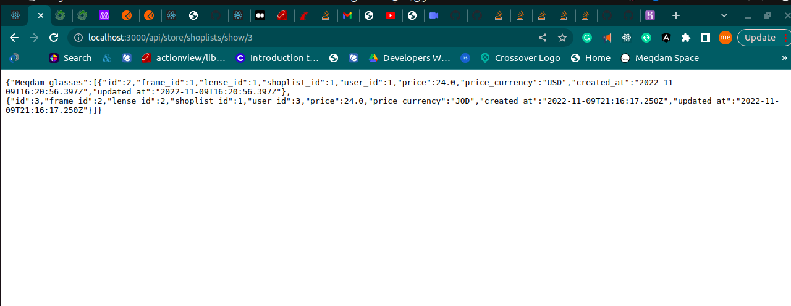
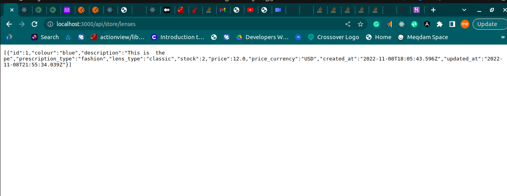

# Helpjuice Search book challenge

## Built With
- ruby on rails
## Video demo
-[Video demo](https://www.loom.com/share/26c0418d82fb439fbd11ff1c7eca741e)
## Deployed version

  [link](https://intense-badlands-65200.herokuapp.com/)

### Prerequisites

Chrome or any explorer
### USAGE
This is a ruby on rails base app which let the users search for some articles in real time 
## Authors

👤 **Meqdam Al-qudah**

- [GitHub](https://github.com/MeqdamAlqudah)
- [Twitter](https://twitter.com/MeqdamQudah)
- [LinkedIn](www.linkedin.com/in/meqdam-al-qudah-7514a21b5)
